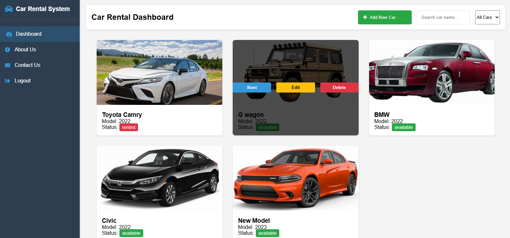
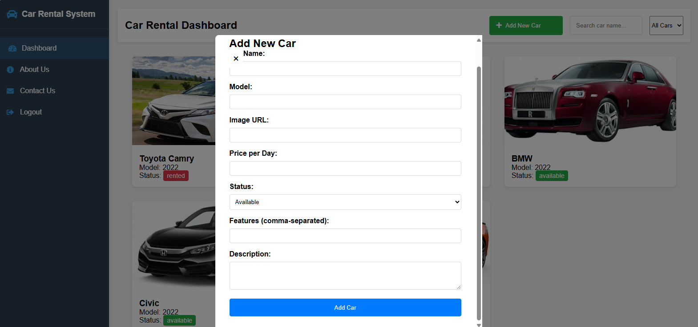
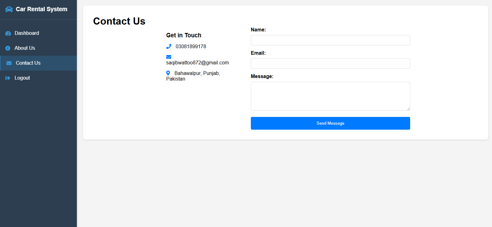
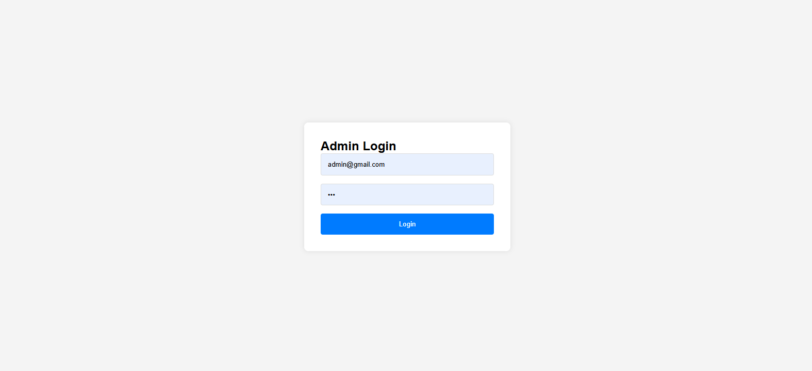

      <h1>  Car Rental System</h1>
      <h3>A Modern Car Rental Management Platform</h3>

    
    
    

## 🔐 Demo Credentials

### Admin Account

- Email: admin@gmail.com
- Password: 123

# 📌 Overview

Car Rental System is a modern web application that provides a seamless platform for managing car rentals. It offers an intuitive interface for both administrators and customers to handle car bookings, returns, and fleet management.

# 🛠️ Tech Stack

## 📸 Screenshots

### Home Page (Dashboard)

  

### Add New Car

  

### Edit Car

  

### About Page

  

### Contact Page

  

### Login Page

  

### Rent Car

  

## 🔑 Key Features

### For Administrators

- Manage car fleet (Add, Edit, Delete)
- Track car status (Available, Rented)
- View and manage rentals
- User management

### For Customers

- Browse available cars
- Search and filter cars
- Rent cars
- Return rented vehicles

### General Features

- Responsive design
- User-friendly interface
- Secure authentication
- Local storage for data persistence
- Real-time status updates

## 🚀 Getting Started

1. Clone the repository

## 🔧 System Requirements

- Modern web browser (Chrome, Firefox, Safari, Edge)
- JavaScript enabled
- Internet connection for loading external resources

## 👨‍💻 Developer Contact

Feel free to reach out for any questions or collaboration:

- GitHub: [@jamalihassan0307](https://github.com/jamalihassan0307)
- LinkedIn: [jamalihassan0307](https://www.linkedin.com/in/jamalihassan0307)

## 🙏 Acknowledgments

Special thanks to:

- Icons8 for the icons
- The open-source community
- All contributors and supporters

## 📄 License

This project is licensed under the MIT License - see the [LICENSE](LICENSE) file for details.
